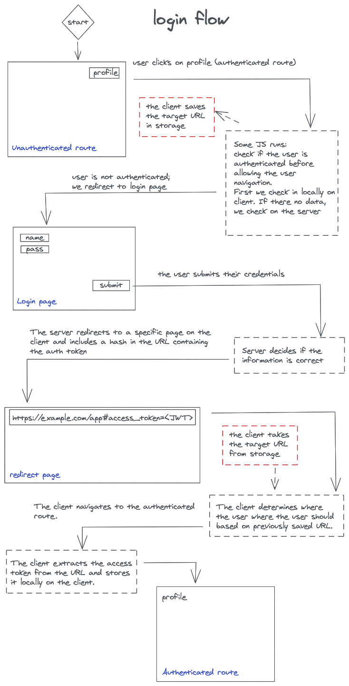
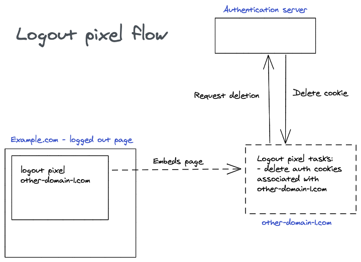

# Oauth Client Core

This library implements the [OIDC implicit flow](https://openid.net/specs/openid-connect-implicit-1_0.html) / [OIDC Code flow with PKCE](https://openid.net/2015/05/26/enhancing-oauth-security-for-mobile-applications-with-pkse/) for use in a front-end web application. The library can be used directly with any framework of choice. While it is not strictly necessary to use wrapper, there is one [available for Angular](https://www.npmjs.com/package/@ilionx/oauth-client-angular).

## Features
- Implicit Flow
- Code Flow with PKCE
- CSRF Tokens
- Code samples
- OpenID Connect Session Management
- Authetication using redirect

## Roadmap

- A future aim is to have this library certified as [OpenID Relying Party] (https://openid.net/certification/#RPs).
- Add support for [all request parameters](https://openid.net/specs/openid-connect-implicit-1_0.html#RequestParameters).
- Move to native Web Crypto API when IE11 support is not needed anymore.
- Authentication using popup

## API Reference

The API reference can be found in the `docs` folder.

## How to set the OIDC Config

```ts
import { configure } from "@ilionx/oauth-client-core";

configure({
  authorisation: "",
  client_id: "",
  ...etc,
});
```

## How to set the Auth headers on API requests

To access resources, a request may need to include authentication information. This is done via te authorization header. Take caution that you only include this header in requests for protected resources; simply including the header in every request is a security risk.

In the following example, we use axios' request interceptors to add this authorization header. With axios, you may create various axios instances with different interceptors to deal with this. With other implementations, you may need to include headers at a request level.

```ts
import {
  checkSession,
  getAuthHeader,
  getStoredAuthResult,
  silentRefresh,
} from "@ilionx/oauth-client-core";
import axios, { AxiosRequestConfig } from "axios";

const setAuthHeader = async (
  config: AxiosRequestConfig,
): Promise<AxiosRequestConfig> => {
  const storedAuthResult = getStoredAuthResult();

  if (storedAuthResult) {
    config.headers["Authorization"] = getAuthHeader(storedAuthResult);

    // For info see Token Expiration section in Readme
    if (
      (storedAuthResult.expires || 0) - Math.round(new Date().getTime() / 1000.0) <
      300
    ) {
      silentRefresh();
    }
    return config;
  } else {
    // The check session method will either return
    // that the user is indeed logged in, or redirect
    // the user to the login page. This redirection
    // will be triggered automatically by the library.
    const isLoggedIn = await checkSession();
    if (isLoggedIn) {
      config = await setAuthHeader(config);
      return config;
    } else {
      throw new axios.Cancel("User is not logged in");
    }
  }
};

// Add a request interceptor
axios.interceptors.request.use(setAuthHeader, (error) => {
  Promise.reject(error);
});

```

## How do I check if the user is authenticated?

On a page level, users should be redirected if they are not authenticated. For this, you can use the check session method. Do note that this method returns a Promise.

```ts
import { checkSession } from "@ilionx/oauth-client-core";

async function processProtectedRoute(): Promise<void> {
  try {
    await checkSession();
    // We may proceed
  } catch (error) {
    // Under normal circumstances, we will never get here, as the
    // checkSession will already have redirected us to the login page in
    // case the authenticated fails.
    return;
  }
}

```

On a component level, you need to make sure at least a auth result is stored

```ts
import { getStoredAuthResult } from "@ilionx/oauth-client-core";

// If a auth result is stored, we can assume the user is logged in.
// This call is synchronous and will as such not influence rendering the page.
getStoredAuthResult();

```

## Token expiration

Often times, the access token is set to expire after a certain period. Before this period is over, we can still request a new token. The renewal of a token should only take place as long as the user continues to use the application. If the application renews tokens without paying attention to user activity, it is a potential threat to the security of the user's information.

A common way to detect application usage is to hook into requests that have been authenticated. These are either requests to the backend API (i.e. requests to protected resources) or front-end navigation to routes that require authentication. In addition, the necessity of creating a new token must be considered. If the expiration time is still far in the future, it should be decided not to renew the token yet.

```ts
import {
  AuthResult,
  checkSession,
  getAuthHeader,
  getStoredAuthResult,
  silentRefresh,
} from "@ilionx/oauth-client-core";
import { AxiosRequestConfig } from "axios";

const refreshTokenAboutToExpire = (authResult?: AuthResult) => {
  if (
    authResult &&
    // The expiry time is calculated in seconds since 1970
    // Check if the token expires in the next 5 minutes, if so, trigger a
    // silent refresh of the Access Token in the OIDC Service
    (authResult.expires || 0) - Date.now() / 1000 < 300
  ) {
    silentRefresh();
  }
};

// ==================================================
// == SOMEWHERE IN THE ROUTER AUTHENTICATION CHECK ==
// ==================================================
checkSession().then((authResult) => {
  if (authResult) {
    // If the authentication was successful, we request
    // a new token (if it is about to expire).
    refreshTokenAboutToExpire(authResult);

    // Returning the auth check result here...
  }
});

// =================================
// == SOMEWHERE IN AN API REQUEST ==
// =================================
const storedAuthResult = getStoredAuthResult();
const config: AxiosRequestConfig = {};
if (storedAuthResult) {
  config.headers["Authorization"] = getAuthHeader(storedAuthResult);
  // After adding the headers, we request
  // a new token (if it is about to expire).
  refreshTokenAboutToExpire(storedAuthResult);
}

```

## Login

The login consists of two steps. Step 1 is to send authentication data to the server (_username_ and _password_ and _csrf token_). Step 2 is processing the response from the server.

### Sending authentication data to the server

Most of the time, it is not needed to create a custom login page. The default page of the CIAM server can be used. The client id can be used by CIAM to determine which login page should be served.

If you are going to create a custom CIAM login page, you need to make sure that besides the username and password, you also send a Cross Site Request Forgery token (csrf) to the SSO server. This can be obtained with the `getCsrfResult()` method.

```ts
import { getCsrfResult } from "@ilionx/oauth-client-core";

getCsrfResult();

```

### Processing the response from the server

An auth token will be present in a response from the server after a successful login. This token must be stored on the user's local computer. The auth token is present in the hash fragment of the redirect url from the server to the client. So, you need to make sure you will not clear the URL before saving it locally.

```ts
import { checkSession } from "@ilionx/oauth-client-core";

async function calledWhenTryingToAuthenticateUser() {
  // The check session method is used for both checking if the user is logged in
  // as well as saving the access token present in the URL hash.
  // After the URL has been saved, it will be cleared.
  await checkSession();
}

```

The current implementation of the redirect from the server only goes to a single URL. This means that restoring the user session (the url where the user was before logging in) is a responsibility of the front-end. Take into account that routes which do not require authentication should not call the check session function (as it will trigger a login).

Because the check session function is used both for the login check and to store the token, it is recommended to do a front-end redirect where the URL hash is kept intact before the check session is used to store the token. This way the user is sent to the correct route after login, which calls the check session anyway (to check if the user is logged in) and consequently also stores the token.



## Logout

The logout form needs a **logout endpoint**, a Cross Site Request Forgery Token (**\_csrf**), a URL to redirect to after the logout has succeeded (**post_logout_redirect_uri**) and an ID Token (**id_token_hint**). The form can be submitted in an automated fashion after all inputs have been set. If the _\_csrf_ or _id_token_hint_ cannot be resolved, an error page should be shown.

```ts
import {
  config,
  getCsrfResult,
  getIdTokenHint,
  getStoredCsrfResult,
} from "@ilionx/oauth-client-core";

// The LOGOUT_ENDPOINT can be requested from
config.logout_endpoint;

// The POST_LOGOUT_REDIRECT_URI can be requested from
config.post_logout_redirect_uri;

// The CSRF_TOKEN can be requested from
//  Synchronously (try this first)
getStoredCsrfResult();
//  Asynchronously
getCsrfResult();

// The ID_TOKEN_HINT can be requested from
getIdTokenHint({ regex: true });

```

```html
<form method="POST" action="LOGOUT_ENDPOINT">
  <input type="hidden" name="_csrf" value="CSRF_TOKEN" />

  <input
    type="hidden"
    name="post_logout_redirect_uri"
    value="POST_LOGOUT_REDIRECT_URI"
  />

  <input type="hidden" name="id_token_hint" value="ID_TOKEN_HINT" />
</form>
```

## Automatic logout

If the session is closed due to inactivity, the user must be logged out to protect the data still on the local computer from access by unauthorized parties. After redirecting to the logged out page, the authentication information will be removed.

In the case a user may still be logged in on another client, they should not be logged out. This is what the isSessionAlive call is for. It checks the server to see if the user is still logged in somewhere. Logging out would also destroy the session for other clients. This would cause these users to eventually be rejected when requesting a renewal of the session, even though they might still be actively using the session.

The `isSessionAlive` call does not count as user activity, and will as such not lengthen the session.

```ts
import {
  getStoredAuthResult,
  isSessionAlive,
} from "@ilionx/oauth-client-core";

const autoLogoutInterval = setInterval(() => {
  // Get stored auth result either returns a non-expired token or null
  const storedToken = getStoredAuthResult();

  if (!storedToken) {
    isSessionAlive().catch(() => {
      // If we are not logged in, no expired check is needed.
      clearInterval(autoLogoutInterval);

      // Remove user information that may exist next to the auth information
      clearUserInformation();

      // You may set a session restore URL here to be used on the
      // login page.
      setSessionRestoreUrl();

      // Navigate to the logged out page via the router.
      navigateToLoggedOutPage();
    });
  }
}, 15000);

```

## Logged out page

See the FAQ for the difference between a logout page and a logged out page.

The logged out page is used to show the user that he has been logged out. Next to this, it should remove local authentication information. This includes local storage on the current domain as well as cookies on other domains via a logout pixel.

### Clean up

Remove possible left-overs of the previous session.

```ts
import { cleanSessionStorage } from "@ilionx/oauth-client-core";

// Upon opening the logged out page
cleanSessionStorage();

```

### Logout pixel

> ! This is an opinionated way of handling logout.

In case there multiple domains that need to be logged out at once, you may choose to include logout pixels. With a logout pixel, you include an invisible iframe or image on the site which is hosted on another domain. The embedded element contains some logic to logout on the hosting domain. In this way the same domain policy for cookies and other local ways authentication data storage can be circumvented.


```html
<!-- As iframe -->
<iframe
  src="https://example.com/logoutpixel"
  width="0"
  height="0"
  class="hidden"
></iframe>

<!-- As img -->

```

If you are creating a logout pixel, you need to:

1.  Make an array of all access tokens in the session storage
    1.  Call the logout endpoint with each token
    1.  Remove the token from session storage
1.  Remove the `_csrf` token from session storage

## Auth Result Filters

It is possible to write a custom filter for the (stored) auth results. This validator will be used to get a valid result from the stored results (a list of all previously saved auth results). This is useful if the auth results you are using have some non-standard behavior.

```ts
import {
  getStoredAuthResult,
  parseJwt,
} from "@ilionx/oauth-client-core";

getStoredAuthResult([
  (authResult) => {
    if (authResult.access_token) {
      const accessToken = parseJwt(authResult.access_token);
      // The backend is creating special tokens which have `someCustomProperty` set
      // to an expected value. We need to validate this.
      return accessToken["someCustomProperty"] === "someExpectedValue";
    }
    return false;
  },
]);

```

## Debug mode 
If you want verbose logging from this package, you can set `config.debug` to `true` in your configuration. 

Another option to enable verbose logging is to set a LocalStorage variable `oauth_client_debug` with any value.

## FAQ

### What is a silent logout?

With a silent logout, you are logged out in the background. This means that you are not redirected to a logged-out page. However, the access token will be invalidated. You would use this when you need the user to be logged out in order to perform a certain action. If you are going to use this method, be sure to clean the session storage afterwards.

```ts
import {
  cleanSessionStorage,
  silentLogout,
} from "@ilionx/oauth-client-core";

silentLogout()
  .then(() => {
    cleanSessionStorage();
  })
  .catch(() => {
    // Handle errors when logout has failed.
  });

```

### What is a silent refresh?

a silent refresh, a new access token is fetched in the background, without user interaction. This also extends the lifetime of the session with the Issuer. An error is returned if an End-User is not already authenticated. For more info, see the [OpenID Connect Core spec](https://openid.net/specs/openid-connect-core-1_0.html#AuthRequest).

### What is the difference between a logout page and a logged out page?

- The purpose of a **logout page** is to initiate and authorise the termination of a session.
- The purpose of a **logged out page** is to show the user that he has been logged out. In addition, the **logged out page** is used to remove authentication information.


### How do I prevent tokens leaking to third parties?

If you are using some kind of analytics tool which registers the url, you want to make sure no access tokens or authorize codes are leaked to third parties.
To prevent this potential security risk a javascript file named `pre-clean-url.js` is bundled within the package. Link this file in the `<head>` of your html file and make sure its the first script that gets loaded. What this script does is store the hash or code in the sessionStorage and removes the parameter from the url. That sessionStorage item is later picked up by the package as if it where the url.
